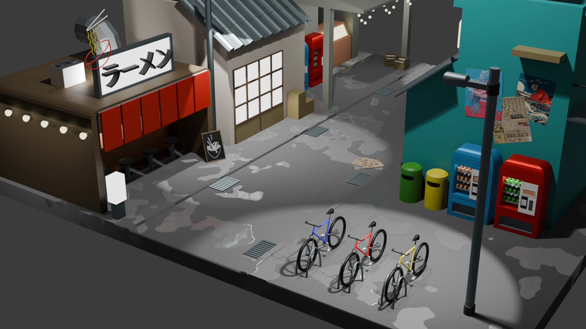
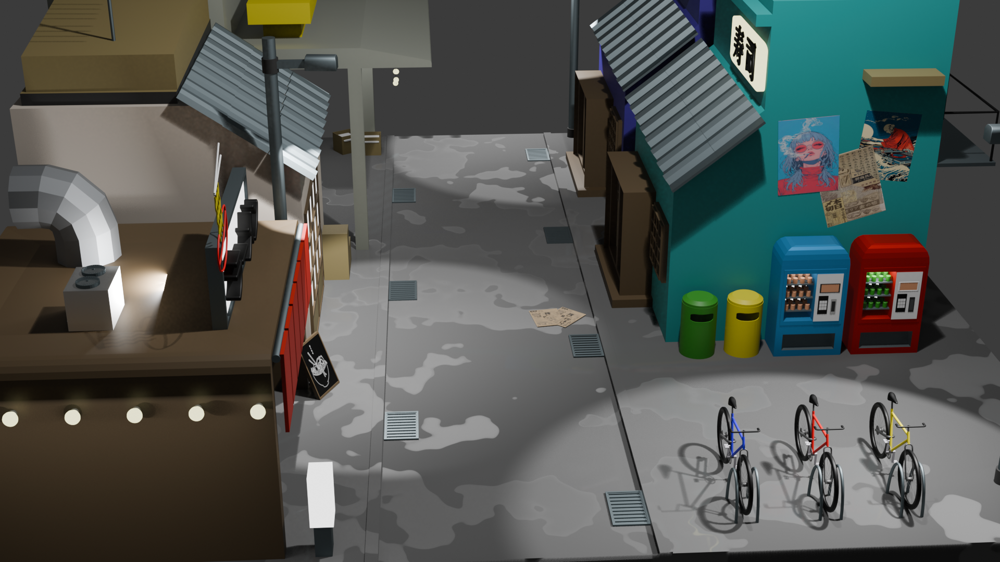
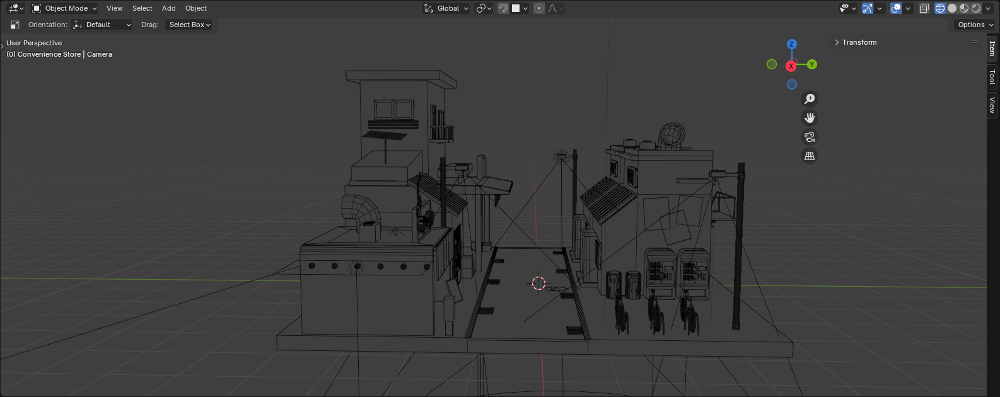

# Tokyo Alley Scene

  
  
  

A rainy Tokyo-inspired alley created in Blender, featuring shops, puddles, and stylized low-poly architecture.

## 📦 What's Included

- Final .blend file
- Rendered images

## 🎨 Tools Used

- Blender
- [Coolors](https://coolors.co) for color palette

## 📝 Notes

- All models are hand-made.
- Textures are either procedural or CC0.

## 📄 License

Feel free to remix or reuse — see `LICENSE`.
